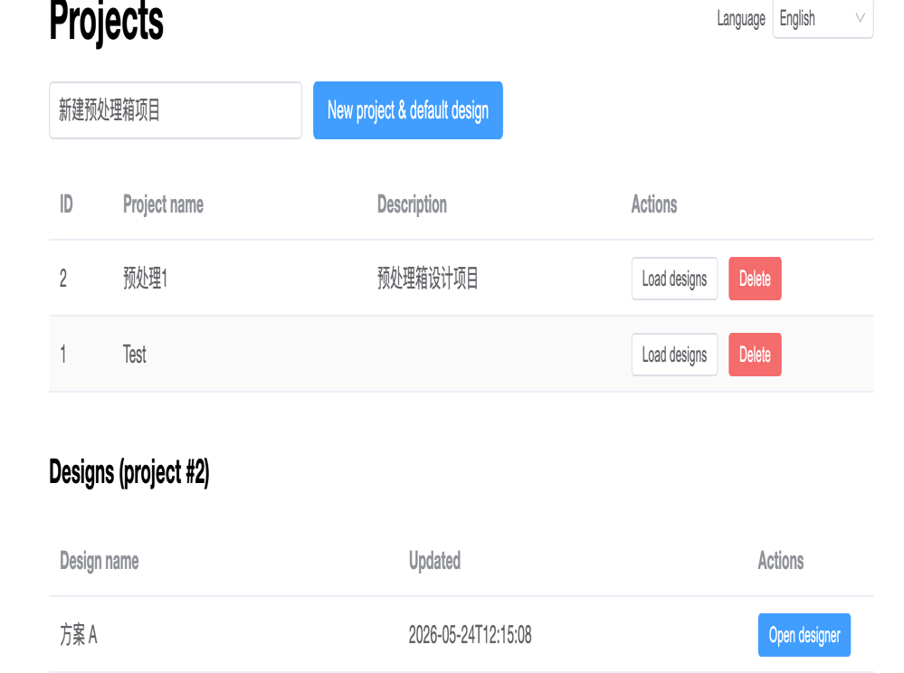
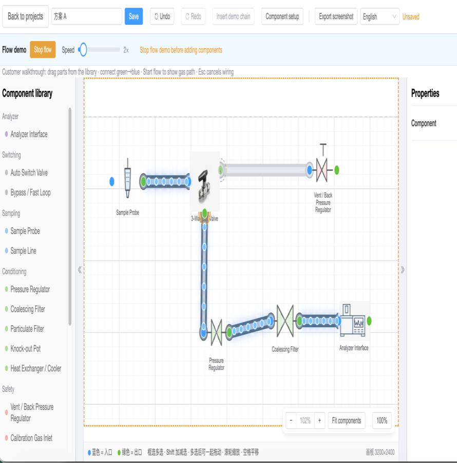

# SCS Designer

**Online Monitoring Sample Conditioning System — P&ID Design & Flow Demonstration Tool**  
**在线监测样品预处理系统 — 流程图设计与动态演示工具**

[](LICENSE)

[English](#english) · [中文](#中文)

**Contact / 联系：** [natureofwind@gmail.com](mailto:natureofwind@gmail.com)

---

## English

### Overview

**SCS Designer** is a web-based engineering drawing and demonstration tool for **sample conditioning systems (SCS)** used in **continuous emissions / process gas online monitoring (CEMS)** and analyzer shelters. Operators and sales engineers can assemble a **P&ID-style process flow** on an interactive canvas, save project variants, and run a **live flow demonstration** to show customers how gas routes through pretreatment hardware—without desktop CAD software.

Typical applications:

- Fast-loop and analyzer conditioning skids  
- Filter trains, pressure regulation, and switching manifolds  
- Customer walkthroughs, training, and proposal reviews  

### Screenshots

#### Project & design management



Create projects, manage multiple design revisions, and open the designer.

#### Interactive P&ID designer with flow demo



Drag-and-drop component library, pipe connections, **flow animation**, runtime controls (e.g. 3-way valve path, flow regulator opening), collapsible side panels, bilingual UI.

### Key capabilities

| Area | Description |
|------|-------------|
| **P&ID canvas** | Grid workspace, zoom/pan, multi-select, green (outlet) → blue (inlet) wiring |
| **Component library** | 17 industrial symbol types across sampling, conditioning, measurement, switching, safety, analyzer, and **piping** categories |
| **Built-in piping parts** | Standard **3-way ball valve**, **3-way tee**, and **flow rate regulator** with fixed appearance; runtime path/speed control during demo |
| **Flow demonstration** | Animated gas “bubbles” along active edges; inactive branches dimmed; demo mode locks canvas editing |
| **Projects & designs** | SQLite (dev) / PostgreSQL (prod); CRUD for projects and saved JSON designs |
| **Customization** | Per-type symbol size, port position, and uploaded images (non-built-in types) |
| **Localization** | Chinese / English UI |
| **Export** | PNG snapshot of the canvas |
| **Engineering API** | Backend endpoints for simplified simulation, validation, and PDF export (optional integration) |

### Built-in piping components (runtime-aware)

| Component | Function in demo |
|-----------|------------------|
| **3-Way Ball Valve** | One inlet, selectable outlet A or B; on-canvas **flow pointer** switches active path |
| **3-Way Tee** | Passive split: one inlet, two simultaneous outlets |
| **Flow Rate Regulator** | Adjustable opening (%); fewer downstream bubbles at lower setpoints |

### Tech stack

| Layer | Technologies |
|-------|----------------|
| Frontend | Vue 3, Vite, TypeScript, Pinia, Element Plus, Konva.js |
| Backend | FastAPI, SQLAlchemy 2.0, Alembic, ReportLab, NetworkX |
| Database | SQLite (local) · PostgreSQL (Docker) |

### Quick start (local)

**1. Backend**

```bash
cd backend
python3 -m venv .venv
source .venv/bin/activate          # Windows: .venv\Scripts\activate
pip install -r requirements.txt
cp ../.env.example .env
uvicorn app.main:app --reload --host 127.0.0.1 --port 8000
```

**2. Frontend**

```bash
cd frontend
npm install
npm run dev
```

Open **http://localhost:5173** — the dev server proxies `/api` to **http://127.0.0.1:8000**.

**Health check:** `GET http://127.0.0.1:8000/health`  
**API docs:** http://127.0.0.1:8000/docs

On first startup the API runs `create_all`, seeds missing component definitions, and serves uploaded symbol images.

### Docker (production)

```bash
cp .env.example .env
docker compose up --build
```

| Service | URL |
|---------|-----|
| Web UI | http://localhost |
| API | http://localhost:8000/docs |

### Database

| Environment | `DATABASE_URL` |
|-------------|----------------|
| Local dev | `sqlite+aiosqlite:///./scs_designer.db` |
| Docker | `postgresql+asyncpg://scs:scs@db:5432/scs_designer` |

Optional migrations: `cd backend && alembic upgrade head`

### API overview

| Method | Path | Purpose |
|--------|------|---------|
| `GET/POST` | `/api/v1/projects` | Projects |
| `GET/POST/PATCH/DELETE` | `/api/v1/designs` | Design documents (JSON graph) |
| `GET` | `/api/v1/components` | Component catalog |
| `POST` | `/api/v1/simulation/run` | Simplified hydraulic/lag simulation |
| `POST` | `/api/v1/validation/check` | Topology & engineering checks |
| `POST` | `/api/v1/export/pdf` | PDF report |
| `POST` | `/api/v1/uploads/...` | Symbol image upload |

Authentication (JWT) is reserved for a future release; the current API is open on the local network.

### Designer usage (short)

1. Create a **project** and open a **design**.  
2. Drag components from the library; connect **green → blue** ports.  
3. Use panel edge buttons to **collapse** the library or properties for more canvas space.  
4. Click **Start flow** to run the demonstration; switch **3-way valve** paths or **regulator** opening in the properties panel or on the valve pointer.  
5. **Stop flow** before adding or rewiring components.  
6. **Save** and **Export screenshot** as needed.

### Repository layout

```
scs-designer/
├── backend/          # FastAPI application, models, seed data
├── frontend/         # Vue designer UI
├── images/           # README screenshots
├── docker-compose.yml
└── .env.example
```

### Contact

[natureofwind@gmail.com](mailto:natureofwind@gmail.com)

### License

MIT

---

## 中文

### 概述

**SCS Designer** 是一款面向 **在线监测（CEMS）样品预处理系统（Sample Conditioning System, SCS）** 的 Web 端 **P&ID 流程图设计与动态演示** 工具。用户可在浏览器中拖拽组装预处理撬块/分析小屋内的典型流路（取样、过滤、减压、切换、分析仪表接口等），保存方案版本，并通过 **流动动画** 向客户直观展示气体走向与阀门切换效果，无需安装桌面 CAD。

典型场景：

- 快速回路（Fast Loop）与分析仪表取样 conditioning  
- 过滤级、减压稳压、多路切换阀组  
- 售前演示、培训讲解、方案评审  

### 界面截图

#### 项目与方案管理


新建项目、管理多套方案、进入设计器。

#### P&ID 设计器与流动演示


组件库拖放、管线连接、**流动演示**、三通阀流向指针、流速调节、侧栏折叠、中英文界面。

### 核心功能

| 模块 | 说明 |
|------|------|
| **P&ID 画布** | 网格画板，缩放/平移/框选；绿色出口连蓝色入口 |
| **组件库** | 17 类工业组件：取样、处理、测量、切换、安全、分析仪、**配管** 等 |
| **内置配管标准件** | **三通阀**、**三通接管**、**流速调节器**（外观固定，演示时可交互） |
| **流动演示** | 管路气泡动画；非活跃支路灰显；演示进行中禁止拖入新组件 |
| **项目/方案** | 项目与 JSON 设计稿持久化（开发 SQLite / 生产 PostgreSQL） |
| **组件定制** | 非内置件可调整尺寸、端口位置、上传示意图 |
| **国际化** | 中文 / English |
| **导出** | 画布 PNG 截图 |
| **工程 API** | 后端提供简化仿真、校验、PDF 导出（可按需集成） |

### 内置配管组件（演示可交互）

| 组件 | 演示行为 |
|------|----------|
| **三通阀** | 一进两出，阀体 **流向指针** 或属性面板选择出口 A/B，未接通支路无流动 |
| **三通接管** | 被动三通，一进两出同时分流 |
| **流速调节器** | 调节开度（%），开度越低下游气泡越少 |

### 技术栈

| 层级 | 技术 |
|------|------|
| 前端 | Vue 3、Vite、TypeScript、Pinia、Element Plus、Konva.js |
| 后端 | FastAPI、SQLAlchemy 2.0、Alembic、ReportLab、NetworkX |
| 数据库 | SQLite（本地）· PostgreSQL（Docker） |

### 快速开始（本地）

**1. 启动后端**

```bash
cd backend
python3 -m venv .venv
source .venv/bin/activate          # Windows: .venv\Scripts\activate
pip install -r requirements.txt
cp ../.env.example .env
uvicorn app.main:app --reload --host 127.0.0.1 --port 8000
```

**2. 启动前端**

```bash
cd frontend
npm install
npm run dev
```

浏览器访问 **http://localhost:5173**，开发环境通过 Vite 将 `/api` 代理至 **http://127.0.0.1:8000**。

**健康检查：** `GET http://127.0.0.1:8000/health`  
**接口文档：** http://127.0.0.1:8000/docs

首次启动会自动建表、增量写入组件种子数据。

### Docker 部署

```bash
cp .env.example .env
docker compose up --build
```

| 服务 | 地址 |
|------|------|
| Web 界面 | http://localhost |
| API 文档 | http://localhost:8000/docs |

### 数据库配置

| 环境 | `DATABASE_URL` |
|------|----------------|
| 本地开发 | `sqlite+aiosqlite:///./scs_designer.db` |
| Docker | `postgresql+asyncpg://scs:scs@db:5432/scs_designer` |

可选迁移：`cd backend && alembic upgrade head`

### API 一览

| 方法 | 路径 | 说明 |
|------|------|------|
| `GET/POST` | `/api/v1/projects` | 项目管理 |
| `GET/POST/PATCH/DELETE` | `/api/v1/designs` | 设计稿（节点/边 JSON） |
| `GET` | `/api/v1/components` | 组件目录 |
| `POST` | `/api/v1/simulation/run` | 简化水力/滞后仿真 |
| `POST` | `/api/v1/validation/check` | 拓扑与工程规则校验 |
| `POST` | `/api/v1/export/pdf` | PDF 报告 |
| `POST` | `/api/v1/uploads/...` | 示意图上传 |

当前版本 API 无鉴权，适用于内网/演示环境；JWT 鉴权预留后续版本。

### 设计器操作要点

1. 新建 **项目** 并打开 **方案**。  
2. 从左侧组件库拖入设备，**绿点 → 蓝点** 连线。  
3. 点击侧栏边缘按钮 **收起/展开** 组件库或属性面板，扩大画布。  
4. 点击 **开始流动** 进入演示；在三通阀上切换 **流向指针**，或调节 **流速开度**。  
5. **停止流动** 后方可继续添加或改线。  
6. **保存** 方案，需要时 **导出截图**。

### 目录结构

```
scs-designer/
├── backend/          # FastAPI 服务、数据模型、组件种子
├── frontend/         # Vue 设计器前端
├── images/           # README 配图
├── docker-compose.yml
└── .env.example
```

### 联系方式

[natureofwind@gmail.com](mailto:natureofwind@gmail.com)

### 许可证

MIT
